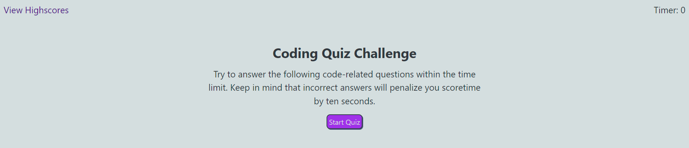

# JavaScript Quiz
(You can access our deployed website here: https://honguyen00.github.io/code-quiz/)

## Description

The aim of this project is to build a simple quiz game that users can participate in. When starting the game, players will be timed and each wrong answer will set the time back for 10 seconds. Finally, the amount of time left will be the player's score and they can save and view all the scores in scoreboard.

## Installation

N/A

## Usage
This is the overall look of the website  

You can access all the highscores by clicking on "View Highscores" in the top left conner or after you finish the quiz and submit your score!

